# Design Document: Chat Booking Links

## Overview

This feature makes restaurant links in chat responses open the in-app fullscreen restaurant card (`FoodPlaceCardFullscreenWrapper`) instead of navigating to an external URL. Three layers are affected:

1. **buildSystemPrompt.ts** — include restaurant slugs (via `getFoodPlaceId`) and numeric IDs alongside website URLs, and instruct the LLM to emit Markdown links using the slug as the URL (e.g. `[Book / Visit](restaurant-slug)`).
2. **formatMessage.tsx** — extend the inline renderer to distinguish between slug-based links (trigger a callback to open the fullscreen card) and `http(s)://` links (open in a new tab). The function signature changes to accept a slug→FoodPlace lookup map and an `onOpenCard` callback.
3. **ChatPanel.tsx** — build the slug lookup map from `foodPlaces`, manage a `selectedFoodPlace` state, pass the lookup and callback into `formatMessage`, and render `FoodPlaceCardFullscreenWrapper` when a card is selected.

No data model or API changes — `FoodPlace.id`, `FoodPlace.name`, and `FoodPlace.website` already exist.

## Architecture

```mermaid
graph LR
    A[JSON data files] -->|id, name, website| B[FoodPlace model]
    B -->|buildSystemPrompt| C[System Prompt with slugs + website URLs + formatting instructions]
    C -->|Mistral via Cloudflare Worker| D["LLM response with [Book / Visit](slug) links"]
    D -->|formatMessage with slug map + callback| E[Rendered chat UI]
    E -->|click slug link| F[onOpenCard callback]
    F -->|sets selectedFoodPlace state| G[FoodPlaceCardFullscreenWrapper renders fullscreen]
```

The Cloudflare Worker proxy and Mistral API are untouched — they already pass through arbitrary Markdown.

## Components and Interfaces

### buildSystemPrompt (modified)

**File:** `src/api/buildSystemPrompt.ts`

Changes:
- Import `getFoodPlaceId` from `ts/utils`.
- In the `restaurantList` map, include the slug and numeric ID for every restaurant: `| ID: ${fp.id} | Slug: ${slug}`.
- Conditionally append `| Website: ${fp.website}` when `fp.website` is truthy (unchanged).
- Update the formatting instruction to tell the LLM to use the restaurant slug as the link URL: `[Book / Visit](slug)`.
- Add an instruction: when the user wants to book or visit, prominently include the slug-based link.

Signature stays the same: `buildSystemPrompt(cityName: string, foodPlaces: FoodPlace[]): string`.

### formatMessage / renderInline (modified)

**File:** `src/components/Chat/formatMessage.tsx`

Changes to `renderInline`:
- Accept two new optional parameters: `slugMap: Map<string, FoodPlace> | undefined` and `onOpenCard: ((fp: FoodPlace) => void) | undefined`.
- Update the Markdown link regex to match both `[text](http...)` and `[text](non-http-slug)` patterns. The regex becomes: `/\[([^\]]+)\]\(([^)]+)\)/` for the link portion.
- For links where the URL starts with `http://` or `https://`: render as `<a href={url} target="_blank" rel="noopener noreferrer">`.
- For links where the URL matches a key in `slugMap`: render as a `<button>` (styled like a link) that calls `onOpenCard(slugMap.get(slug))`.
- For links where the URL is a non-http string that does NOT match any slug in `slugMap`: render as plain text (no clickable element).

Changes to `formatMessage`:
- Signature changes to: `formatMessage(text: string, slugMap?: Map<string, FoodPlace>, onOpenCard?: (fp: FoodPlace) => void): React.ReactNode`.
- Passes `slugMap` and `onOpenCard` through to every `renderInline` call.

### ChatPanel (modified)

**File:** `src/components/Chat/ChatPanel.tsx`

Changes:
- Import `getFoodPlaceId` from `ts/utils`, `FoodPlaceCardFullscreenWrapper`, and relevant enums.
- Build a `slugMap: Map<string, FoodPlace>` from `foodPlaces` using `useMemo`, keyed by `getFoodPlaceId(fp.name)`.
- Add state: `const [selectedFoodPlace, setSelectedFoodPlace] = useState<FoodPlace | null>(null)`.
- Define `onOpenCard` callback: sets `selectedFoodPlace` to the given `FoodPlace`.
- Pass `slugMap` and `onOpenCard` to `formatMessage` in the message rendering loop.
- When `selectedFoodPlace` is non-null, render a `FoodPlaceCardFullscreenWrapper` overlay with `isFullScreen={true}`. The wrapper needs `city`, `foodPlace`, `onLike`, `isFullScreen`, and `showToast` props.
- Since `ChatPanel` currently receives `cityName: string` (a `CityEnum` value), it can pass `cityName` as `city` after casting.
- For `onLike` and `showToast`: these are needed by `FoodPlaceCardFullscreenWrapper`. The simplest approach is to add them as optional props on `ChatPanelProps` (threaded from `ChatWidget` ← `City`), or provide no-op defaults for the chat context where liking/toasting isn't the primary use case.

**Decision:** Add `onLike` and `showToast` as optional props on `ChatWidgetProps` and `ChatPanelProps`, threaded from `City.tsx`. This keeps the card fully functional (like button, share toast) even when opened from chat. If not provided, use no-op defaults.

### ChatWidget (modified)

**File:** `src/components/Chat/ChatWidget.tsx`

Changes:
- Add optional `onLike` and `showToast` props to `ChatWidgetProps`.
- Pass them through to `ChatPanel`.

### City (modified)

**File:** `src/components/City/City.tsx`

Changes:
- Pass `onLike` and `showToast` to `ChatWidget`.

## Data Models

No changes. `FoodPlace` already has `id: number`, `name: string`, and optional `website?: string`. The slug is derived at runtime via `getFoodPlaceId(fp.name)`.

When `website` is an empty string (the deserializer defaults missing fields to `""`), it is treated as falsy — same as `undefined`.

## Correctness Properties

*A property is a characteristic or behavior that should hold true across all valid executions of a system — essentially, a formal statement about what the system should do. Properties serve as the bridge between human-readable specifications and machine-verifiable correctness guarantees.*

### Property 1: System prompt contains correct per-restaurant metadata

*For any* list of FoodPlaces, the system prompt produced by `buildSystemPrompt` should contain, for each restaurant: its numeric ID, its slug (as produced by `getFoodPlaceId`), and its website URL if and only if the restaurant has a truthy `website` value. Restaurants with a falsy website should not have a "Website:" entry in their prompt line.

**Validates: Requirements 1.1, 1.2, 1.3, 1.4**

### Property 2: Slug links render as interactive buttons that trigger the card callback

*For any* chat message containing a Markdown link `[text](slug)` where `slug` is a key in the provided slug map, `formatMessage` should render a `<button>` element (not an `<a>`) whose click handler invokes `onOpenCard` with the `FoodPlace` corresponding to that slug.

**Validates: Requirements 3.1, 3.2, 4.1**

### Property 3: HTTP links render as anchor elements opening in a new tab

*For any* chat message containing a Markdown link `[text](url)` where `url` starts with `http://` or `https://`, `formatMessage` should render an `<a>` element with `target="_blank"` and `rel="noopener noreferrer"` and `href` equal to the URL.

**Validates: Requirements 3.3**

### Property 4: Unrecognized link targets render as plain text

*For any* chat message containing either (a) a Markdown link `[text](slug)` where `slug` does not match any key in the slug map, or (b) a bare URL not wrapped in Markdown link syntax, `formatMessage` should render the content as plain text with no clickable element.

**Validates: Requirements 3.4, 4.3**

## Error Handling

- **Missing slug map / callback:** When `formatMessage` is called without a `slugMap` or `onOpenCard` (e.g. from a context that doesn't have restaurant data), all Markdown links fall through to the HTTP branch or plain text. No crash.
- **Unknown slug in LLM response:** If the LLM hallucinates a slug not in the map, the link renders as plain text (Property 4). The user sees the text but cannot click it.
- **Empty / malformed Markdown links:** The regex requires both `[text]` and `(url)` portions. Malformed syntax is left as-is in the text.
- **FoodPlaceCardFullscreenWrapper errors:** The card component already handles missing images, missing website, etc. gracefully. No additional error handling needed in ChatPanel.

## Testing Strategy

### Property-Based Tests

Use `fast-check` as the property-based testing library (already idiomatic for TypeScript/React projects).

Each property test must:
- Run a minimum of 100 iterations
- Reference its design property with a tag comment: `// Feature: chat-booking-links, Property {N}: {title}`

| Property | What to generate | What to assert |
|----------|-----------------|----------------|
| Property 1 | Random arrays of FoodPlace objects with varying `id`, `name`, `website` (truthy/falsy) | Prompt string contains ID, slug, and website iff truthy for each FoodPlace |
| Property 2 | Random message strings containing `[text](slug)` with slugs drawn from a generated slug map | Rendered output contains a `<button>` element; simulated click calls `onOpenCard` with correct FoodPlace |
| Property 3 | Random message strings containing `[text](https://...)` | Rendered output contains an `<a>` with correct `href`, `target`, and `rel` |
| Property 4 | Random message strings with `[text](unknown-slug)` or bare `https://...` without Markdown syntax | Rendered output contains no `<a>` or `<button>` for those segments |

### Unit Tests

Keep unit tests focused on specific examples and edge cases:
- `buildSystemPrompt` with a restaurant that has no website → line should not contain "Website:"
- `buildSystemPrompt` with an empty restaurant list → prompt still valid, no crash
- `formatMessage` with a message containing both a slug link and an HTTP link → both render correctly in the same message
- `formatMessage` with no slug map provided → HTTP links still work, slug-like links render as plain text
- Click on a rendered slug button → `onOpenCard` called with the right `FoodPlace`
- `ChatPanel` renders `FoodPlaceCardFullscreenWrapper` when `selectedFoodPlace` is set
