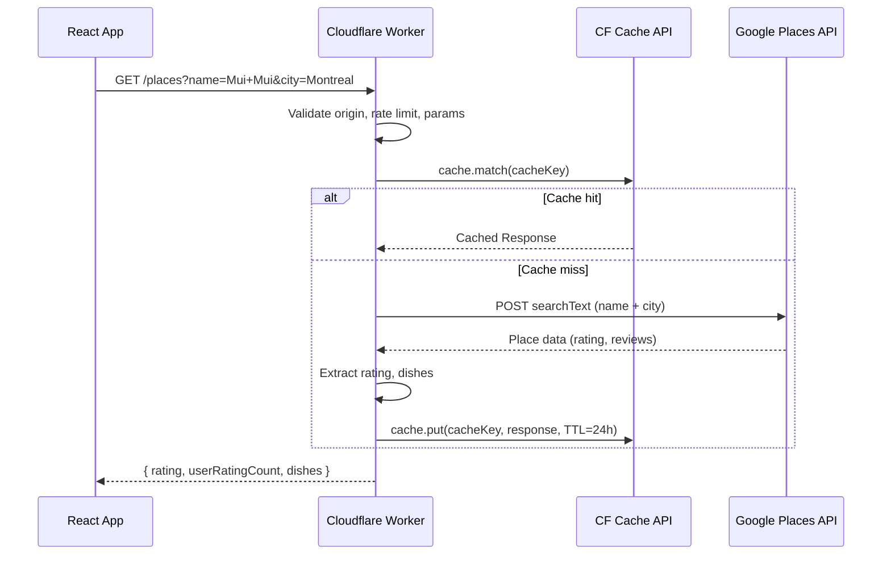
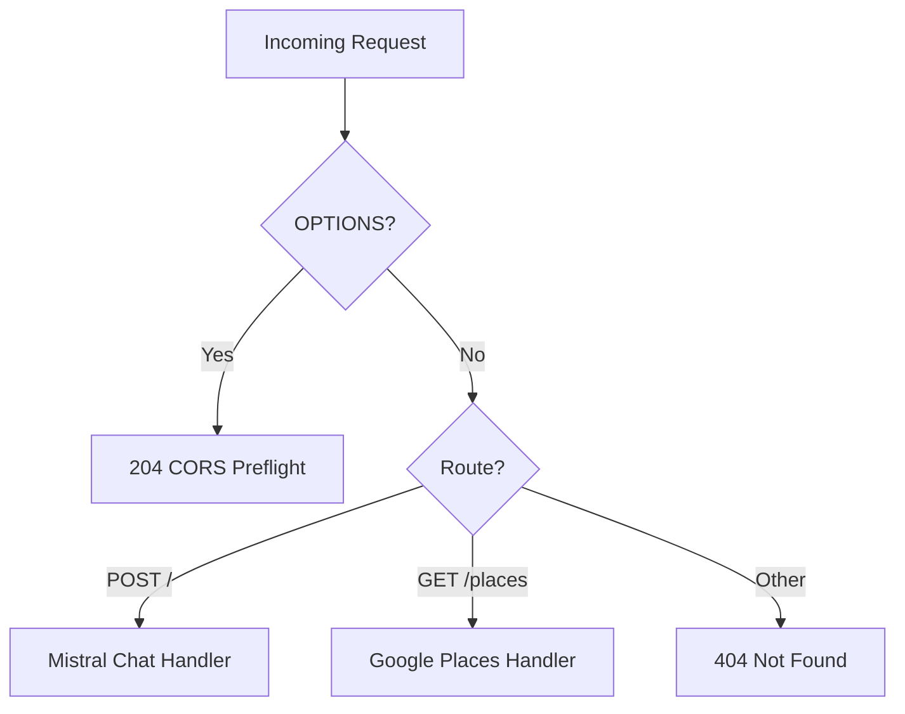

# Design Document: Google Ratings & Dishes

## Overview

This feature enriches the Culinary Passport app with live Google ratings (star rating + review count) and suggested dishes for each restaurant. A new route is added to the existing Cloudflare Worker (`culinary-passport-api`) to proxy requests to the Google Places API (New), keeping the API key server-side. Responses are cached for 24 hours using the Cloudflare Cache API. On the client side, a new service fetches this data lazily (on card visibility / fullscreen open) and caches it in-memory for the session. The FoodPlace model gains optional fields, and the FoodPlaceCard renders rating and dish information with appropriate loading/error/empty states.

### Key Design Decisions

1. **Same worker, new route** — Rather than deploying a separate worker, we add a `GET /places` route to the existing `culinary-passport-api` worker. This reuses the existing CORS, geo-blocking, and rate-limiting infrastructure and avoids a second deployment pipeline. The worker's `fetch` handler becomes a lightweight router dispatching on `pathname` and `method`.
2. **Google Places API (New)** — We use the `searchText` endpoint from the Places API (New) which accepts a text query and returns structured place data including `rating`, `userRatingCount`, and `reviews`. This is a single API call per restaurant lookup.
3. **Cloudflare Cache API for caching** — We use the Cache API (available in Workers) with a 24-hour TTL. This is simpler than KV (no extra binding/cost) and sufficient for this read-heavy, low-cardinality use case (~50-100 restaurants total).
4. **Dish extraction from reviews/editorial summary** — The Google Places API returns `editorialSummary` and `reviews`. We extract dish names by looking for food-related nouns in review text using a lightweight keyword extraction approach, capped at 5 dishes per restaurant.
5. **Lazy fetching with IntersectionObserver** — Data is fetched only when a card enters the viewport or is opened fullscreen, minimizing API calls on page load.

## Architecture



### Worker Route Structure



## Components and Interfaces

### Worker Side

#### Router (worker/src/index.ts)

The existing default export's `fetch` handler is refactored into a simple path-based router:

- `POST /` → existing Mistral chat handler (unchanged behavior)
- `GET /places` → new Google Places handler
- `OPTIONS` on any path → CORS preflight (unchanged)

Shared middleware (CORS headers, geo-blocking, rate limiting) runs before routing.

#### Google Places Handler (worker/src/placesHandler.ts)

```typescript
interface PlacesRequest {
  name: string;  // restaurant name (query param)
  city: string;  // city name (query param)
}

interface PlacesResponse {
  rating: number | null;        // 1.0–5.0 or null
  userRatingCount: number | null; // total reviews or null
  dishes: string[];              // max 5 items, may be empty
}
```

Responsibilities:
- Parse and validate `name` and `city` query parameters
- Build cache key from normalized `name+city`
- Check Cloudflare Cache API for cached response
- On miss: call Google Places API `searchText`, extract fields, cache result
- Return `PlacesResponse` as JSON

#### Dish Extraction (worker/src/extractDishes.ts)

A pure function that takes Google Places review text and/or editorial summary and returns up to 5 dish names. Uses simple heuristic extraction (common food-related patterns in review text). This is isolated for testability.

```typescript
function extractDishes(
  reviews: GoogleReview[],
  editorialSummary?: string
): string[];
```

### Client Side

#### GooglePlacesService (src/api/GooglePlacesService.ts)

```typescript
interface GooglePlacesData {
  rating: number | null;
  userRatingCount: number | null;
  dishes: string[];
}

function fetchGooglePlacesData(name: string, city: string): Promise<GooglePlacesData>;
```

- Calls `GET <WORKER_URL>/places?name=...&city=...`
- Maintains an in-memory `Map<string, GooglePlacesData>` cache keyed by `name|city`
- Returns cached data immediately if available
- On fetch failure, returns `{ rating: null, userRatingCount: null, dishes: [] }` and logs to console

#### useGooglePlacesData Hook (src/hooks/useGooglePlacesData.ts)

```typescript
function useGooglePlacesData(name: string, city: string, enabled: boolean): {
  data: GooglePlacesData | null;
  isLoading: boolean;
};
```

- `enabled` controls when fetching starts (tied to visibility / fullscreen)
- Returns loading state for skeleton UI
- Handles errors silently (returns null data, logs to console)

#### RatingDisplay Component (src/components/FoodPlaceList/Card/RatingDisplay.tsx)

Renders star rating (numeric with 1 decimal + star icon) and review count (formatted, e.g. "1.2k reviews"). Renders nothing when rating is null.

#### DishesDisplay Component (src/components/FoodPlaceList/Card/DishesDisplay.tsx)

Renders dish names as tag chips (reusing the existing `Tag` component pattern). Accepts a `maxItems` prop (3 for compact, 5 for fullscreen). Renders nothing when dishes array is empty.

#### FoodPlaceCard Changes

- Accepts `city` name (already available as `CityEnum` prop) for the API lookup
- Uses `useGooglePlacesData` hook, enabled when card is visible (via IntersectionObserver) or fullscreen
- Renders `RatingDisplay` between the name and tags
- Renders `DishesDisplay` after the tags (fullscreen) or after description (compact, max 3)
- Shows subtle loading placeholder while data is being fetched

### Environment Configuration

- New env var `REACT_APP_PLACES_API_URL` pointing to the worker URL + `/places` path
- Worker secret `GOOGLE_PLACES_API_KEY` stored via `wrangler secret put`

## Data Models

### FoodPlace Model Extension

The `FoodPlace` class gains three optional fields. These are NOT persisted in the JSON data files — they are populated at runtime from the Google Places API response.

```typescript
// Added to FoodPlace class
googleRating: number | null;       // e.g. 4.3
googleReviewCount: number | null;  // e.g. 1247
suggestedDishes: string[];         // e.g. ["Pad Thai", "Green Curry"]
```

Default values: `null`, `null`, `[]` respectively.

These fields are set via a setter method or direct assignment after the Google Places data is fetched — they are not part of the `deserialize` static method since they don't come from the JSON data files.

### Google Places API Response Shape (relevant fields)

From the Google Places API (New) `searchText` response:

```typescript
interface GooglePlaceResult {
  places: Array<{
    displayName: { text: string };
    rating?: number;
    userRatingCount?: number;
    editorialSummary?: { text: string };
    reviews?: Array<{
      text: { text: string };
      rating: number;
    }>;
  }>;
}
```

### Worker Cache Entry

Cached as a JSON `Response` object in the Cloudflare Cache API:

```typescript
// Cache key: https://cache.internal/places/{normalizedName}/{normalizedCity}
// Cache value: Response with JSON body
{
  "rating": 4.3,
  "userRatingCount": 1247,
  "dishes": ["Pad Thai", "Green Curry", "Tom Yum"]
}
// Cache-Control: max-age=86400 (24 hours)
```

### Review Count Formatting

The `userRatingCount` is formatted for display:
- < 1000: shown as-is (e.g. "847 reviews")
- ≥ 1000: shown with "k" suffix (e.g. "1.2k reviews")
- Exactly 1: "1 review" (singular)

