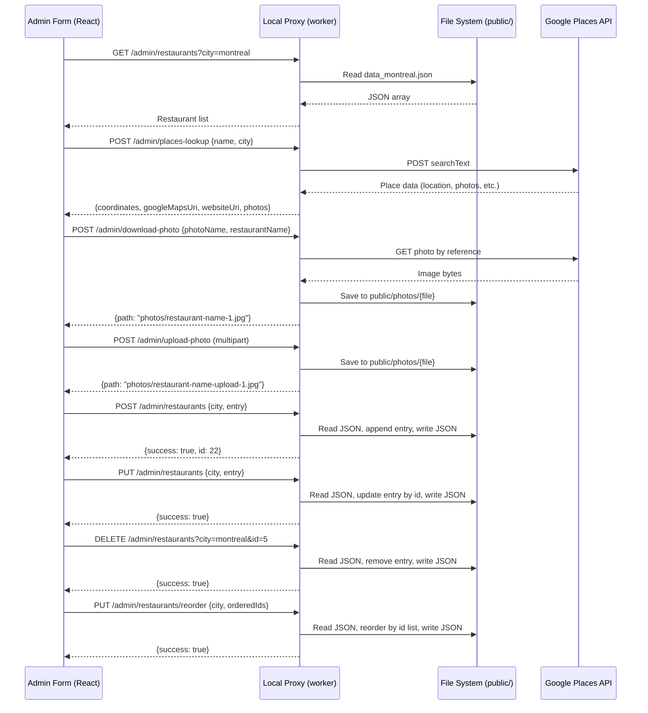

# Design Document: Local Restaurant Admin

## Overview

A local-only admin tool for managing restaurant entries in The Culinary Passport app. The tool is a React page accessible at `/#/admin` that communicates with new REST endpoints on the existing local proxy (`worker/src/local-proxy.js`) to perform CRUD operations on the city-specific JSON data files (`public/data_{city}.json`). Google Places API integration auto-fills coordinates, Google Maps link, website, and photos. The admin tool runs exclusively in the local Docker development environment and is never deployed to production.

### Key Design Decisions

1. **Volume mount for `./public` in the worker container** — The worker container currently only mounts `./worker/src`. To allow the local proxy to read/write JSON data files and save photos, we add `'./public:/app/public'` to the worker service in `docker-compose.yml`. This is the cleanest approach since the proxy already handles API calls and file I/O is a natural extension.

2. **Plain Node.js endpoints on the existing local proxy** — Rather than introducing a new server, we add REST endpoints to `worker/src/local-proxy.js`. This keeps the architecture simple and reuses the existing CORS and `.dev.vars` loading infrastructure.

3. **Conditional route via environment variable** — The `/#/admin` route is only registered when `REACT_APP_LOCAL_ADMIN=true` is set in the environment. In `docker-compose.yml` this is set for the main app container. In production builds (CI/CD), this variable is absent, so the admin route and its code are excluded via conditional rendering (not code-split, since CRA doesn't support dynamic `import()` for routes without ejecting — but the route simply won't render).

4. **Reuse existing FoodPlaceCard for preview** — The preview renders the actual `FoodPlaceCard` component with mock props, giving the content editor an accurate representation of how the entry will look.

5. **ID assignment server-side** — The local proxy assigns `id = max(existing ids) + 1` when creating a new entry. This avoids race conditions and keeps the client simple.

6. **Google Places API (New) for lookup** — We use the `searchText` endpoint (same API already used by the existing `/places` route) but request different fields: `places.location`, `places.googleMapsUri`, `places.websiteUri`, `places.formattedAddress`, `places.photos`.

## Architecture



### Docker Compose Change

```yaml
# docker-compose.yml — worker service
worker:
  build: ./worker
  command: ["node", "src/local-proxy.js"]
  ports:
    - "8787:8787"
  volumes:
    - './worker/src:/app/src'
    - './worker/.dev.vars:/app/.dev.vars'
    - './public:/app/public'          # NEW: gives proxy access to data files & photos
```

## Components and Interfaces

### Local Proxy Endpoints (worker/src/local-proxy.js)

All admin endpoints are prefixed with `/admin/` and only exist in the local proxy (never deployed).

#### GET /admin/restaurants?city={city}

Returns all restaurant entries for the given city.

- Reads `public/data_{city}.json`
- Returns the JSON array as-is
- 400 if city is missing or invalid

#### POST /admin/restaurants

Creates a new restaurant entry.

```typescript
// Request body
interface CreateRequest {
  city: string;           // "montreal" | "paris" | "tokyo" | "london"
  entry: Omit<FoodPlaceEntry, 'id'>;
}

// Response
interface CreateResponse {
  success: boolean;
  id: number;             // assigned id
}
```

- Reads the target JSON file, finds `max(id)`, assigns `id = max + 1`
- Appends entry to array, writes back with 4-space indentation
- Returns the assigned id

#### PUT /admin/restaurants

Updates an existing restaurant entry by id.

```typescript
interface UpdateRequest {
  city: string;
  entry: FoodPlaceEntry;  // must include id
}
```

- Finds entry by `id`, replaces it, writes back with 4-space indentation
- 404 if id not found

#### DELETE /admin/restaurants?city={city}&id={id}

Deletes a restaurant entry.

- Removes entry with matching id from the array
- Writes back with 4-space indentation
- 404 if id not found

#### PUT /admin/restaurants/reorder

Reorders entries for a city.

```typescript
interface ReorderRequest {
  city: string;
  orderedIds: number[];   // full list of ids in desired order
}
```

- Validates that `orderedIds` contains exactly the same ids as the file
- Reorders the array to match `orderedIds` order
- Writes back with 4-space indentation

#### POST /admin/places-lookup

Looks up a restaurant via Google Places API (New).

```typescript
interface PlacesLookupRequest {
  name: string;
  city: string;
}

interface PlacesLookupResponse {
  coordinates: [number, number] | null;  // [lat, lng]
  googleMapsUri: string | null;
  websiteUri: string | null;
  formattedAddress: string | null;
  photos: Array<{ name: string; widthPx: number; heightPx: number }>;
}
```

- Calls Google Places API `searchText` with `textQuery: "{name} {city}"`
- Requests fields: `places.location,places.googleMapsUri,places.websiteUri,places.formattedAddress,places.photos`
- Returns first result's data, or error if no results

#### POST /admin/download-photo

Downloads a Google Places photo and saves it locally.

```typescript
interface DownloadPhotoRequest {
  photoName: string;       // Google Places photo resource name
  restaurantName: string;  // for filename generation
  index: number;           // sequential index for uniqueness
}

interface DownloadPhotoResponse {
  path: string;            // relative path, e.g. "photos/mui-mui-1.jpg"
}
```

- Fetches photo via `https://places.googleapis.com/v1/{photoName}/media?maxWidthPx=800&key=...`
- Generates filename: slugified restaurant name + `-` + index + `.jpg`
- Saves to `public/photos/` directory (creates dir if needed)
- Returns relative path from `public/`

#### POST /admin/upload-photo (multipart/form-data)

Handles local image file uploads.

- Parses multipart form data (restaurant name + file)
- Saves file to `public/photos/` with slugified name + timestamp
- Returns relative path

### React Components

#### AdminPage (src/components/Admin/AdminPage.tsx)

Top-level page component for `/#/admin`. Contains:
- City selector (dropdown)
- Restaurant list panel (left/top)
- Form panel (right/bottom)
- Conditional rendering based on `REACT_APP_LOCAL_ADMIN`

#### AdminRestaurantList (src/components/Admin/AdminRestaurantList.tsx)

Displays all restaurants for the selected city.

```typescript
interface AdminRestaurantListProps {
  city: string;
  restaurants: FoodPlaceEntry[];
  onEdit: (entry: FoodPlaceEntry) => void;
  onDelete: (id: number) => void;
  onMoveUp: (id: number) => void;
  onMoveDown: (id: number) => void;
}
```

- Shows name, neighborhood, cuisine type per entry
- Edit, Delete, Move Up, Move Down buttons per row

#### AdminForm (src/components/Admin/AdminForm.tsx)

The main form for creating/editing a restaurant entry.

```typescript
interface AdminFormProps {
  city: string;
  existingEntry?: FoodPlaceEntry;  // populated when editing
  existingNames: string[];          // for duplicate detection
  onSave: (entry: Omit<FoodPlaceEntry, 'id'> | FoodPlaceEntry) => void;
  onCancel: () => void;
}
```

Form fields:
- Restaurant name (text input, required)
- Google Places lookup button
- Description (textarea)
- Cuisine types (multi-select/tag input)
- Price range (select: `$`, `$$`, `$$$`)
- Neighborhood (text input)
- Coordinates — lat/lng (number inputs, auto-filled)
- Google Maps URL (text input, auto-filled)
- Website URL (text input, auto-filled, optional)
- Instagram URL (text input, optional)
- Images (list with add URL, upload file, remove actions)
- Tags (multi-input)

#### AdminPreview (src/components/Admin/AdminPreview.tsx)

Renders a read-only preview using the existing `FoodPlaceCard` component with the current form data. Provides a "Back to Edit" button.

#### AdminPhotoManager (src/components/Admin/AdminPhotoManager.tsx)

Manages the images array:
- Displays current images as thumbnails
- Add image URL input
- Upload local file button
- Remove button per image
- Shows Google Places photos after lookup (with add/remove)

### Admin API Service (src/api/AdminService.ts)

Client-side service for calling the local proxy admin endpoints.

```typescript
const ADMIN_API_URL = 'http://localhost:8787/admin';

async function fetchRestaurants(city: string): Promise<FoodPlaceEntry[]>;
async function createRestaurant(city: string, entry: Omit<FoodPlaceEntry, 'id'>): Promise<{ id: number }>;
async function updateRestaurant(city: string, entry: FoodPlaceEntry): Promise<void>;
async function deleteRestaurant(city: string, id: number): Promise<void>;
async function reorderRestaurants(city: string, orderedIds: number[]): Promise<void>;
async function placesLookup(name: string, city: string): Promise<PlacesLookupResponse>;
async function downloadPhoto(photoName: string, restaurantName: string, index: number): Promise<{ path: string }>;
async function uploadPhoto(restaurantName: string, file: File): Promise<{ path: string }>;
```

### Routing Change (src/App.tsx)

```tsx
// Conditionally import and render admin route
{process.env.REACT_APP_LOCAL_ADMIN === 'true' && (
  <Route path="/admin" element={<AdminPage />} />
)}
```

### Environment Variable

Added to `docker-compose.yml` for the main app container:

```yaml
the-culinary-passport:
  environment:
    - REACT_APP_LOCAL_ADMIN=true
```

## Data Models

### FoodPlaceEntry (JSON shape)

This is the raw JSON shape stored in the data files, matching the existing format:

```typescript
interface FoodPlaceEntry {
  id: number;
  name: string;
  tags: string[];
  description: string;
  price: string;                    // "$" | "$$" | "$$$"
  typeOfCuisine: string[];
  neighborhood?: string;
  images?: string[];
  googleMaps?: string;
  instagram?: string;
  website?: string;
  coordinates?: [number, number];   // [lat, lng] tuple
  stayType?: string;                // "TOURIST" | "LOCAL"
}
```

### City-to-File Mapping

```typescript
const CITY_FILE_MAP: Record<string, string> = {
  montreal: 'data_montreal.json',
  paris: 'data_paris.json',
  tokyo: 'data_tokyo.json',
  london: 'data_london.json',
};
```

### Validation Rules

| Field | Rule |
|-------|------|
| name | Non-empty string, trimmed |
| city | One of: montreal, paris, tokyo, london |
| coordinates | Array of exactly 2 numbers (lat, lng) |
| typeOfCuisine | Non-empty array of strings |
| price | One of: `$`, `$$`, `$$$` |
| description | String (may be empty) |
| images | Array of strings (may be empty) |
| googleMaps | String (optional) |
| instagram | String (optional) |
| website | String (optional) |
| tags | Array of strings (may be empty) |


## Correctness Properties

*A property is a characteristic or behavior that should hold true across all valid executions of a system — essentially, a formal statement about what the system should do. Properties serve as the bridge between human-readable specifications and machine-verifiable correctness guarantees.*

### Property 1: City-to-file mapping

*For any* valid city name (montreal, paris, tokyo, london), the city-to-file mapping function SHALL return the correct filename `data_{city}.json`, and for any invalid city name, it SHALL return an error or null.

**Validates: Requirements 2.2**

### Property 2: Form validation rejects incomplete data

*For any* form data object, if the restaurant name is empty or whitespace-only, OR the city is not selected, OR coordinates are missing, OR the typeOfCuisine array is empty, then validation SHALL reject the submission. Conversely, if all required fields are present and valid, validation SHALL accept the submission regardless of whether optional fields (instagram, website, description, images) are empty.

**Validates: Requirements 3.2, 7.3, 12.1, 12.2, 12.3, 12.4**

### Property 3: Google Places field extraction

*For any* valid Google Places API response containing a `places` array with at least one result, the extraction function SHALL return the `location` (as coordinates), `googleMapsUri`, `websiteUri`, `formattedAddress`, and `photos` array from the first result. Fields absent from the API response SHALL be returned as null.

**Validates: Requirements 4.2, 4.3, 4.4, 11.1, 11.3**

### Property 4: Photo download respects limit

*For any* Google Places API response containing N photo references (where N >= 0), the photo download process SHALL download at most 3 photos (min(N, 3)).

**Validates: Requirements 4.5**

### Property 5: Unique filename generation

*For any* two distinct (restaurantName, index) pairs, the generated filenames SHALL be different. *For any* restaurant name containing special characters, spaces, or unicode, the generated filename SHALL contain only lowercase alphanumeric characters, hyphens, and the file extension.

**Validates: Requirements 11.5**

### Property 6: Create restaurant round-trip

*For any* valid FoodPlaceEntry (without id) and any valid city, creating the entry via the save endpoint and then reading the city's JSON file SHALL yield an array containing an entry with all the same field values as the input, plus an assigned id.

**Validates: Requirements 10.2**

### Property 7: ID assignment is max plus one

*For any* existing array of FoodPlaceEntry objects with ids, the newly assigned id SHALL equal `max(existing ids) + 1`. For an empty array, the assigned id SHALL be 1.

**Validates: Requirements 10.3**

### Property 8: JSON file formatting consistency

*For any* write operation (create, update, delete, reorder), the resulting JSON file content SHALL be valid JSON and SHALL be formatted with exactly 4-space indentation (equivalent to `JSON.stringify(data, null, 4)`).

**Validates: Requirements 10.4, 14.5, 15.4, 17.4**

### Property 9: Update preserves id and modifies entry

*For any* existing FoodPlaceEntry with a known id, updating that entry with new field values SHALL result in the JSON file containing the updated values at the same id. The total number of entries in the file SHALL remain unchanged.

**Validates: Requirements 14.4**

### Property 10: Delete removes exactly one entry

*For any* existing array of FoodPlaceEntry objects and any valid id present in the array, deleting that id SHALL result in an array with exactly one fewer entry, and the removed entry SHALL be the one with the matching id. All other entries SHALL remain unchanged.

**Validates: Requirements 15.3**

### Property 11: Reorder preserves entries and applies order

*For any* existing array of FoodPlaceEntry objects and any valid permutation of their ids, reordering with that permutation SHALL produce an array where: (a) the entries appear in the order specified by the permutation, (b) no entries are added or removed, and (c) each entry's data is unchanged.

**Validates: Requirements 17.3**

### Property 12: Case-insensitive duplicate detection

*For any* restaurant name string and any list of existing restaurant names, the duplicate detection function SHALL return true if and only if there exists an existing name that matches the input when both are compared case-insensitively (lowercased). The comparison SHALL be symmetric: checking "Sushi Momo" against ["sushi momo"] and "sushi momo" against ["Sushi Momo"] SHALL both return true.

**Validates: Requirements 16.1**

## Error Handling

### Local Proxy Errors

| Scenario | HTTP Status | Response |
|----------|-------------|----------|
| Missing/invalid city parameter | 400 | `{ "error": "Invalid city. Must be one of: montreal, paris, tokyo, london" }` |
| Missing restaurant name on lookup | 400 | `{ "error": "Missing required field: name" }` |
| Entry not found for update/delete | 404 | `{ "error": "Restaurant with id {id} not found in {city}" }` |
| JSON file read/write failure | 500 | `{ "error": "Failed to read/write data file: {details}" }` |
| Google Places API failure | 502 | `{ "error": "Google Places API error: {details}" }` |
| Google Places no results | 404 | `{ "error": "No results found for '{name}' in {city}" }` |
| Photo download failure | 502 | `{ "error": "Failed to download photo: {details}" }` |
| Invalid reorder (mismatched ids) | 400 | `{ "error": "Provided ids do not match existing entries" }` |
| Multipart parse failure | 400 | `{ "error": "Invalid file upload" }` |

### Client-Side Error Handling

- All API calls wrapped in try/catch with user-facing error messages via toast notifications (using existing `ToastNotificationEnum`)
- Google Places lookup failure shows inline error and enables manual entry for all fields
- Network errors show a generic "Could not connect to local server" message
- Validation errors are shown inline next to the relevant form fields

### File System Safety

- The proxy reads the full JSON file before writing, ensuring atomic read-modify-write
- JSON is parsed and re-serialized (not string-manipulated) to prevent corruption
- If `public/photos/` directory doesn't exist, it is created before saving photos

## Testing Strategy

### Property-Based Testing

Property-based tests use `fast-check` (the standard PBT library for TypeScript/JavaScript). Each property test runs a minimum of 100 iterations.

Each test is tagged with a comment referencing the design property:
```typescript
// Feature: local-restaurant-admin, Property 1: City-to-file mapping
```

Properties to implement as PBT:

1. **City-to-file mapping** (Property 1) — Generate random valid/invalid city strings, verify correct file mapping
2. **Form validation** (Property 2) — Generate random form data with various combinations of missing/present fields, verify validation accepts/rejects correctly
3. **Google Places field extraction** (Property 3) — Generate random API response shapes, verify correct field extraction
4. **Photo download limit** (Property 4) — Generate responses with 0-10 photo references, verify at most 3 are processed
5. **Filename generation** (Property 5) — Generate random restaurant names with special chars, verify uniqueness and valid characters
6. **Create round-trip** (Property 6) — Generate random valid entries, save and read back, verify equality
7. **ID assignment** (Property 7) — Generate random arrays of entries with various id distributions, verify new id = max + 1
8. **JSON formatting** (Property 8) — Generate random entry arrays, write them, verify 4-space indentation
9. **Update round-trip** (Property 9) — Generate random entries, update with random new values, verify id preserved and values updated
10. **Delete correctness** (Property 10) — Generate random arrays, delete random valid id, verify exactly one removed
11. **Reorder correctness** (Property 11) — Generate random arrays, apply random permutation, verify order and data integrity
12. **Duplicate detection** (Property 12) — Generate random name pairs with various casing, verify case-insensitive matching

### Unit Tests

Unit tests complement property tests for specific examples and edge cases:

- Admin route renders when `REACT_APP_LOCAL_ADMIN=true` and does not render when absent
- City selector shows exactly 4 options (Montreal, Paris, Tokyo, London)
- Preview renders using FoodPlaceCard with correct props
- Delete confirmation dialog appears before deletion proceeds
- Duplicate warning is displayed but does not block save
- Error messages display correctly for API failures
- Empty array edge case for ID assignment (should assign id 1)
- Move up on first item and move down on last item are no-ops
- Photo upload with invalid file type is rejected

### Test File Organization

```
src/
  components/Admin/__tests__/
    AdminForm.test.tsx          # Unit tests for form rendering and validation
    AdminRestaurantList.test.tsx # Unit tests for list rendering
    AdminPreview.test.tsx       # Unit tests for preview rendering
  api/__tests__/
    AdminService.test.ts        # Unit tests for API service
worker/
  src/__tests__/
    admin-endpoints.test.js     # Property + unit tests for proxy endpoints
    filename-gen.test.js        # Property tests for filename generation
    places-extraction.test.js   # Property tests for Google Places field extraction
    validation.test.js          # Property tests for form validation logic
```
